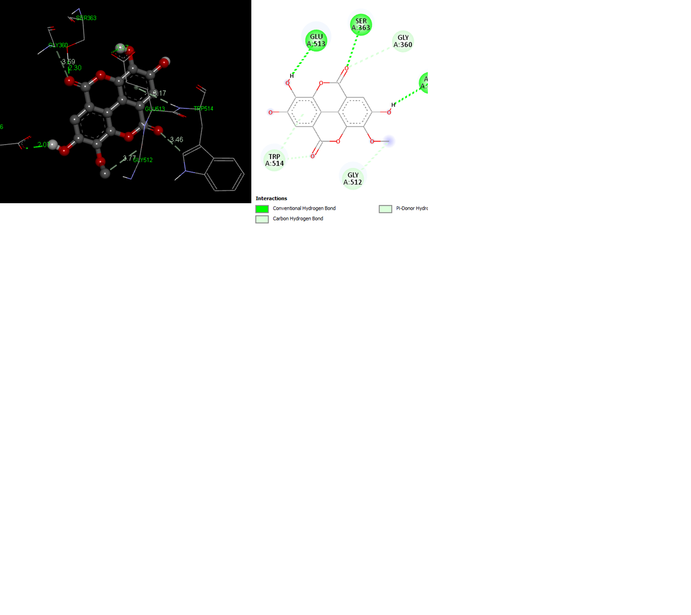

# Investigating the Molecular Connections between Natural Phytochemicals and Type II Diabetes

## Abstract

Type II diabetes (T2D) represents a multifaceted metabolic disorder characterized by insulin resistance and impaired glucose metabolism. Despite the availability of antidiabetic drugs, their efficacy is often limited, underscoring the need for novel therapeutic strategies. In this study, we investigate potential molecular associations between natural phytochemicals and specific receptors linked to T2D. Employing advanced computational techniques, we systematically analyze the interaction of phytochemical compounds obtained from distinct botanical sources, including Momordica charantia L., Trigonella foenum-graecum L., Moringa oleifera, Psidium guajava, Allium cepa, Glycyrrhiza glabra, Gymnema sylvestre, Lagerstroemia speciosa, Salvia officinalis, and Urtica dioica, with receptors intricately implicated in T2D pathophysiology. This study elucidates the binding mechanisms and affinity patterns of these identified phytochemicals with pivotal receptors -alpha-glucosidase, alpha-amylase, and CAPN10-integral to insulin signaling and glucose homeostasis. The ADMET analysis additionally disclosed hydrophobic interactions, hydrogen bond acceptors, and hydrogen bond donors, confirming adherence to the Lipinski Rule of five.
In conclusion, the study reveals remarkable potential in kaempferol, ellagic acid, and 3-O-methyl ellagic acid, compounds extracted from Allium cepa and Lagerstromia speciosa, as drug candidates for treating Type II Diabetes (T2D). The demonstrated high binding affinities, such as -8.5 for Kaempferol with Alpha-amylase, -8.6 for Ellagic acid with Alpha Glucosidase, and -7.7 for 3-O-Methylellagic acid with CAPN10, highlight their substantial interaction with key enzymes. Their pharmacokinetic characteristics further support their suitability for secure and successful T2D therapy.  These findings present a promising avenue for further research and development, offering tangible solutions in the fight against T2D.

#### Keywords: *Type 2 Diabetes, Molecular Modeling, Binding site, Phytochemicals, Virtual Screening*

## Objective:
The objective of this project is to investigate the molecular connections between various natural phytochemicals derived from different plants and type 2 diabetes using bioinformatics tools and methods. The project aims to identify potential mechanisms of action and therapeutic targets for the phytochemicals in the context of type 2 diabetes.

## Methods

Figure 1. Workflow

### 1. Target Identification and Validation:

The biological targets were identified from the Pubmed database through a literature search (https://pubmed.ncbi.nlm.nih.gov/). The protein and gene sequence of the targets were retrieved from Uniprot (https://www.uniprot.org/) (Consortium, 2023) and Genbank (https://www.ncbi.nlm.nih.gov/genbank/) (Agarwal & Gupta, 2016) respectively. The physical and chemical properties of selected proteins were then accessed using the Protparam tool of the ExPASy website (https://web.expasy.org/protparam/) (Consortium, 2023). The 3-dimensional structure of  the CAPN10 protein was retrieved from the AlfaFold database of the EMBL_EBI server (https://alphafold.ebi.ac.uk/)(Sayers et al., 2020). The secondary structure analysis of caplain protein was generated using the PredictProtein tool (https://predictprotein.org/) (Gasteiger et al., 2003). The 3D models of proteins were validated by using the PDBsum database (http://www.ebi.ac.uk/thornton-srv/databases/pdbsum/) (Jumper et al., 2021). The other two biological receptors were identified by using the PDB (https://www.rcsb.org/) database with PBD IDs 5NN8 and 6OCN (Yachdav et al., 2014).

### 2. Binding site Prediction:
The binding site of protein was predicted using PrankWeb, a web server for ligand binding site prediction and visualization (https://prankweb.cz/) (Laskowski et al., 2018) and Computed Atlas of Surface Topography  (CastP, http://sts.bioe.uic.edu/castp/), a computational tool employed for the identification, quantification, and examination of cavities and vacant regions within three-dimensional protein architectures (Berman et al., 2000). The approach of employing both tools for the same task is underpinned by the principle of seeking consensus through the synthesis of predictions generated by both PrankWeb and CastP. By amalgamating the outcomes of these tools, we aimed to enhance the precision and reliability of the binding site prediction, thereby facilitating robust downstream analytical investigations.

### 3.  Pathway Analysis:
The pathway analysis was conducted using the following databases https://www.genome.jp/entry/K08579, https://www.genome.jp/entry/3.2.1.1, and https://www.genome.jp/entry/3.2.1.20 to verify CAPN10, α-amylase and α-glycosidase as biological targets implicated in Type II diabetes pathogenesis as well as identify pathways associated with our biological targets. 

### 4. Phytochemical Retrieval:
The phytochemicals were retrieved from IMPPAT (Indian Medicinal Plants, Phytochemistry And Therapeutics ) (https://cb.imsc.res.in/imppat/) (Jendele et al., 2019). The plants from which the phytochemicals were retrieved were *Momordica charantia L., Trigonella foenum-graecum L, Moringa oleifera Lam, Psidium guajava, Allium cepa, glycyrrhiza glabra, Gymnema sylvestre, Lagerstroemia speciosa, salvia officinalis, Urtica dioica*. About 17 Phytochemicals were retrieved from *Allium cepa*. Following that, 50 phytochemicals were taken from *Glycyrrhiza glabra*.

### 5. Compound Library Construction and Structure Elucidation:
The compound library was constructed based on retrieved phytochemicals.  The ligand structures were drawn and modified by using Chemsketch Software (https://www.acdlabs.com/resources/free-chemistry-software-apps/chemsketch-freeware/) (supplementary file 1). Exploration of quantum or classical model potential energy surfaces with single point, geometry optimization, or transition state search calculations of ligands was done by using Chebi tools, PDBsum (http://www.ebi.ac.uk/thornton-srv/databases/pdbsum/) (Jumper et al., 2021). The Compound library of approximately 458 phytochemicals was created using these tools and softwares.

### 6. Virtual Screening and Drug Likeness: 
The screening of phytochemicals was conducted utilizing FAF-Drugs4, a virtual screening server accessible at https://mobyle.rpbs.univ-paris-diderot.fr/cgi-bin/portal.py#forms::FAF-Drugs4.  FAF-Drugs4 (Binkowski et al., 2003) represents an advanced approach amalgamating machine learning and molecular docking methodologies to forecast the Absorption, Distribution, Metabolism, and Excretion (ADME) attributes of candidate compounds. 

Figure 2. Alpha Glucosidase Pathway

      

Figure 3. Amylase Pathway

##Results :

 ## Team Members
1.Shivani Pawar

2.Nigel Dolling
   
3.Musa Muhammad Shamsuddeen
 
4.Raphael Abban
 
5.Sivanandam Magudeeswaran

